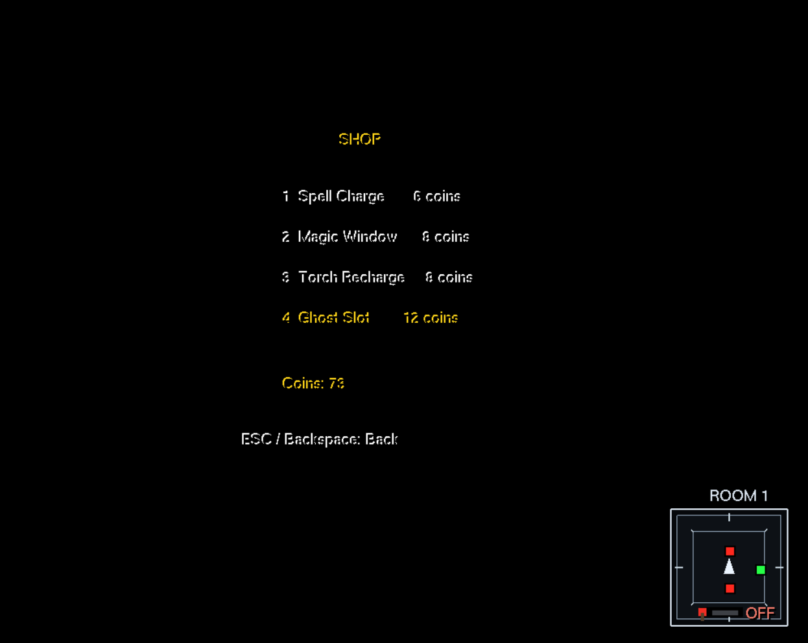
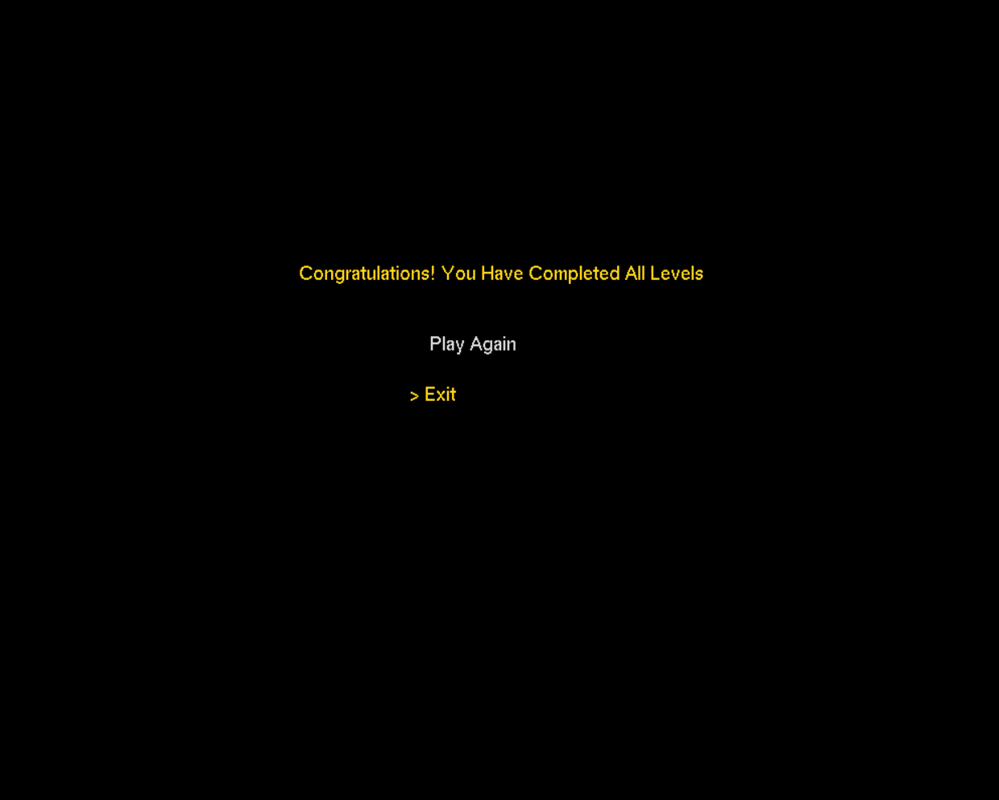

````markdown
# 👻 Yesterday's Shadow

### A 3D Time-Manipulation Puzzle & Stealth Game

> **You only have one body. So how do you press multiple buttons at once?**

**Yesterday's Shadow** is a 3D puzzle, time-manipulation, and stealth game developed using **Python, PyOpenGL, GLUT, and GLU** for the CSE423 Computer Graphics course.

The player is trapped inside a haunted castle and must escape a series of increasingly difficult rooms.

The main mechanic of the game is the **Time-Freeze Spell**. The player can temporarily freeze the room timer, record their movement during a limited Magic Window, and create a **Ghost** that replays the recorded action.

The player can then use their past actions together with their current actions to solve puzzles that require multiple interactions at the same time.

---

## 🎮 Gameplay

The main gameplay loop is:

```text
Enter Room
     ↓
Observe Puzzle
     ↓
Use Time-Freeze
     ↓
Magic Window Starts
     ↓
Perform an Action
     ↓
Movement is Recorded
     ↓
Ghost is Created
     ↓
Ghost Replays the Action
     ↓
Player + Ghosts Work Together
     ↓
Puzzle is Solved
     ↓
Exit Opens
     ↓
Next Level
````

The game contains **three progressively difficult levels**. Each level introduces new challenges while building on the Ghost mechanic.

---

# ✨ Features

### 👻 Time & Ghost Mechanics

* Time-Freeze Spell
* Magic Window
* Player movement recording
* Ghost creation
* Ghost movement replay
* Multiple Ghosts
* Simultaneous button puzzles
* Ghost-based puzzle solving

### 🏰 Level Mechanics

* Three unique levels
* Button and pressure-plate puzzles
* Locked and unlocked doors
* Interactive environmental objects
* Level-specific objectives
* Final extraction portal
* Closing wall challenge

### 🔦 Stealth & Survival

* Torch system
* Limited torch power
* Darkness when torch power is depleted
* Shadow detection system
* Shadow chase mechanic
* Health system
* Lives system
* Spike hazards
* Rift hazards
* Level timers

### 🪙 Economy

* Collectible coins
* Coin rewards
* Time-based rewards
* Ghost/button rewards
* In-game Shop
* Torch recharge
* Spell upgrades
* Magic Window upgrades
* Ghost slot upgrades

### 🎮 Game Systems

* Main menu
* How to Play screen
* Controls screen
* Pause menu
* Restart Level
* Restart Game
* Level failure state
* Game completion state
* Victory screen
* HUD
* Minimap

---

# 👻 The Ghost Mechanic

The Ghost system is the central gameplay mechanic.

When the player activates the Time-Freeze Spell:

```text
1. Normal level timer pauses
              ↓
2. Magic Window starts
              ↓
3. Player performs an action
              ↓
4. Player movement is recorded
              ↓
5. Magic Window ends
              ↓
6. A Ghost is created
              ↓
7. Ghost replays the recorded movement
              ↓
8. Normal level timer continues
```

The Ghost follows the player's previously recorded movement.

This allows the player to create a sequence of past actions.

For example:

```text
Ghost 1 → Button A

Ghost 2 → Button B

Player → Button C

        ↓

Multiple buttons activated
        ↓
     Puzzle solved
```

The Ghost system is designed around the idea that the player's **past actions become part of the present puzzle**.

---

# 🏰 Levels

## Level 1 — Learning the Ghost Mechanic

The first level introduces the core Time-Freeze and Ghost system.

The player learns how to:

* Use the Time-Freeze Spell
* Record movement
* Create a Ghost
* Place a Ghost on a button
* Activate another button themselves
* Unlock the exit
* Complete the first room

---

## Level 2 — Shadow & Two-Ghost Puzzle

The second level increases the puzzle difficulty.

The player must use multiple Ghosts to activate required buttons while dealing with the Shadow and limited torch power.

### Torch & Shadow

The torch creates an important gameplay decision:

```text
TORCH ON
   ↓
Player can see
   ↓
Shadow can detect the player
   ↓
Shadow can follow


TORCH OFF
   ↓
Room becomes darker
   ↓
Shadow cannot detect/follow the player
   ↓
Navigation becomes harder
```

The player therefore needs to balance **visibility and stealth**.

---

## Level 3 — The Closing Walls

The final level combines the major mechanics of the game.

The player must deal with:

* Multiple Ghosts
* Multiple buttons
* Closing/sliding walls
* Spike hazards
* Rift hazards
* Shadow
* Torch management
* Limited time
* Health and lives

The player must activate the required buttons to control the closing walls and reach the final extraction area.

---

# 🧱 Closing Walls

The final level introduces a dynamic wall mechanism.

Buttons control the wall system.

The player uses Ghosts to maintain the required button states while navigating the room.

Conceptually:

```text
Ghost
  ↓
Button
  ↓
Wall Mechanism
  ↓
Wall Movement / Halt
```

The player must coordinate their current actions with previous Ghost actions to successfully overcome the final challenge.

---

# 🔦 Torch System

The torch is an important exploration and stealth mechanic.

The torch has limited power.

When the torch is active:

* The environment is easier to navigate.
* The player can see the room more clearly.
* The Shadow can detect the player in the relevant level.

When torch power reaches zero:

* The room becomes noticeably darker.
* Navigation becomes harder.
* The player can purchase torch recharges from the Shop.

This makes torch management an important part of later-level gameplay.

---

# 👤 Shadow System

The Shadow is an enemy mechanic introduced in the later levels.

Its detection depends on the player's torch.

```text
Torch ON
   ↓
Shadow detects player
   ↓
Shadow follows player


Torch OFF
   ↓
Shadow cannot detect player
```

The player can therefore use darkness as a way to avoid detection, but doing so makes navigation more difficult.

---

# 🪙 Coin System

The game includes an in-game currency system.

Players can earn coins through different gameplay activities, including:

* Collecting coins
* Successfully placing a Ghost on a required button
* Completing a level
* Completing a level quickly
* Other gameplay rewards

Collectible coins can appear at different valid floor positions when a level starts or restarts.

Collected coins can then be spent in the Shop.

---

# 🛒 Shop

The Shop allows the player to spend collected coins on gameplay resources and upgrades.

The available systems include:

| Upgrade        |     Cost |
| -------------- | -------: |
| Spell Charge   |  6 coins |
| Magic Window   |  8 coins |
| Torch Recharge |  8 coins |
| Ghost Slot     | 12 coins |

The Shop provides the player with additional resources that can help them complete difficult levels.

---

# ⚠️ Hazards

The later levels contain environmental hazards.

### Spikes

Spikes can damage the player's health when encountered.

### Rifts

Rifts create additional dangerous areas that the player must navigate around.

Players must manage their health and remaining lives while solving puzzles.

---

# ❤️ Health & Lives

The player has a health and life system.

Taking damage from hazards or enemy interactions can reduce the player's health.

If the player fails a level, they can retry the current level.

---

# ⏱️ Timer System

The game contains level timers and a separate Magic Window timer.

The level timer limits how long the player has to complete a room.

During Time-Freeze:

```text
Normal Level Timer
       ↓
    PAUSED
       ↓
Magic Window
       ↓
Ghost Recording
       ↓
Magic Window Ends
       ↓
Level Timer Continues
```

The Magic Window limits how long the player has to record an action.

---

# 🗺️ Minimap

The game includes a minimap to help the player understand their position within the environment.

The minimap provides additional spatial awareness while navigating the 3D rooms and solving puzzles.

---

# 🎮 Controls

| Key          | Action                        |
| ------------ | ----------------------------- |
| `W`          | Move Forward                  |
| `A`          | Move Left                     |
| `S`          | Move Backward                 |
| `D`          | Move Right                    |
| `Arrow Keys` | Menu / Navigation             |
| `F`          | Time-Freeze / Ghost Recording |
| `T`          | Toggle Torch                  |
| `K`          | Open Shop                     |
| `R`          | Restart Level                 |
| `ESC`        | Pause / Back                  |
| `Mouse`      | Menu / Shop Interaction       |

---

# ⏸️ Pause & Restart

The game provides a pause system during gameplay.

Two restart concepts are available:

### Restart Level

Restarts the currently active level.

### Restart Game

Resets the game progression and starts again from Level 1.

---

# 🏆 Game Completion

After successfully completing all three levels, the game displays:

```text
Congratulations! You Have Completed All Levels
```

The player can then choose:

```text
Play Again
Exit
```

Selecting **Play Again** starts the game from Level 1.

---

# 🛠️ Technologies

This project was developed using:

* **Python**
* **PyOpenGL**
* **OpenGL**
* **GLUT**
* **GLU**

The project is a 3D OpenGL-based game developed for **CSE423 – Computer Graphics**.

---

# 🚀 Installation

## Requirements

* Python 3.x
* PyOpenGL
* PyOpenGL_accelerate

### Install dependencies

```bash
pip install -r requirements.txt
```

Or:

```bash
pip install PyOpenGL PyOpenGL_accelerate
```

---

# ▶️ Running the Game

Clone the repository:

```bash
git clone https://github.com/YOUR-USERNAME/Yesterdays-Shadow.git
```

Enter the project directory:

```bash
cd Yesterdays-Shadow
```

Run:

```bash
python src/yesterdays_shadow.py
```

---

# 📁 Project Structure

```text
Yesterdays-Shadow/
│
├── README.md
├── requirements.txt
├── .gitignore
│
├── src/
│   └── yesterdays_shadow.py
│
├── screenshots/
│   ├── main-menu.png
│   ├── level-1.png
│   ├── level-2.png
│   ├── shop.png
│   ├── level-3.png
│   └── victory.png
│
└── docs/
    └── Yesterday's Shadow.pdf
```

---

# 📸 Screenshots

## Main Menu


## Level 1


## Level 2


## Shop



## Level 3


## Victory Screen



---

# 🎓 Academic Project

**Course:** CSE423 – Computer Graphics

**Project:** Yesterday's Shadow

**Project Type:** 3D Puzzle / Time-Manipulation / Stealth Game

The project combines 3D graphics programming with interactive gameplay systems and a custom Ghost-based time-manipulation mechanic.

---

# 👥 Team

Developed as a group project for CSE423 – Computer Graphics.

### Contributors

* **MD. Neamautullah Rahat**
* **MD. Arafat Chouwdhury**
* **Ali Ahbab**

---

# 💡 Project Concept

The central idea behind **Yesterday's Shadow** is simple:

> **Your past actions become your present companions.**

Instead of controlling multiple characters at the same time, the player records their own actions and turns those actions into Ghosts.

These Ghosts allow the player to solve puzzles that would otherwise require multiple characters.

The game combines:

**Time Manipulation + Ghost Replay + Puzzle Solving + Stealth + Resource Management**

into one 3D gameplay experience.

---

## 📄 Documentation

The project report and additional documentation are available in the `docs/` directory.

---

## ⚠️ Disclaimer

This project was developed as an academic project for educational purposes as part of the CSE423 Computer Graphics course.

````